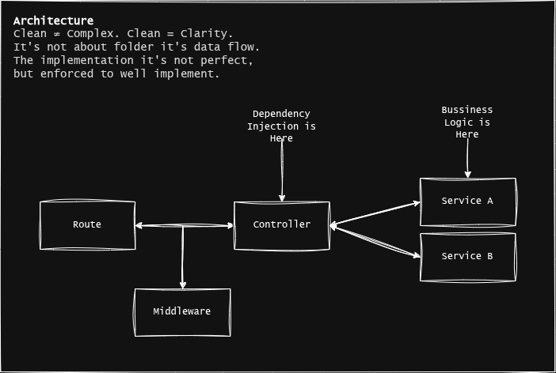

# Rekomendasiin Super App Backend  

I will do with Behavior-driven development (BDD/TDD) with Waterfall Method.  
Not Agile!. I Don't have money for asking people to use my app!.

This is a store app, but it's not a multi tenant app!. Thread you as a master not a slave like another app!. This is just tool, That you can use. I Mean the whole app, not just the BE only, if just BE, it's also sucks!.

Really it's open source??? Yes!.  

License : BSD.  

Project Code Name : "rekomendasiin-store-engine"  

## Architecture



Tech Specs :  

- [ ] Auth  
  - [ ] Google Auth (OAuth2)
  - [ ] Firebase Auth (Phone Number)
  - [ ] Basic Auth 🏗️
  - [ ] Magic Link (Concept)
  - [ ] OTP 🏗️
- [x] Prisma ORM (Concept)
- [ ] Event (Async Service)
- [ ] Payment Module (Payment Gateway Integration)
- [ ] Product (App Feature) - In Progress 🏗️
- [ ] LLM Invocation (AI) - In Progress 🏗️
- [ ] RBAC/ABAC (Owner, Billing, Admin, User)
- [ ] Security Best Practice 🏗️
- [ ] Unit Test - In Progress 🏗️
- [ ] E2E Test
- [ ] Swagger API Documentation
- [ ] Semi Micro Service (Concept)
- [ ] GRPC
- [ ] REST APIs 🏗️
- [ ] Websocket
- [x] SMTP
- [x] Bundler (Rollup)
- [x] Logger
- [x] Containerize app
- [x] Email Template
- [ ] DevEx
  - [x] React Email (Email Tooling)
  - [x] Docker (Containerization)
  - [x] Bruno API Client
  - [x] Resend (SMTP Server)
  - [x] Prisma (Database ORM)

## Doc Setup Rollup

<https://medium.com/@robinviktorsson/setting-up-a-modern-typescript-project-with-rollup-no-framework-e24a7564394c>

## Building

```shell
pnpm install
pnpm exec prisma generate  
pnpm build

#
# We doesn't need need step below anymore
# we already bundling the only needed dependency.
#
# because the repository using husky as git hook
# so it may unset first the prepare script
# read : https://joshtronic.com/2022/07/10/husky-command-not-found-with-npm-install-production/
cd dist
pnpm pkg set scripts.prepare=" "
pnpm install --production
```

## Footnotes  

Readable Codes!, Maintainable Codes!, Future Proof!.
